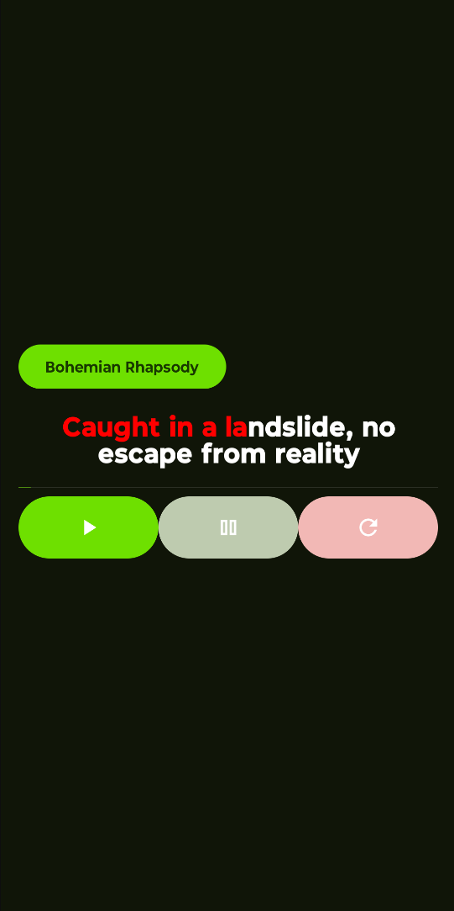
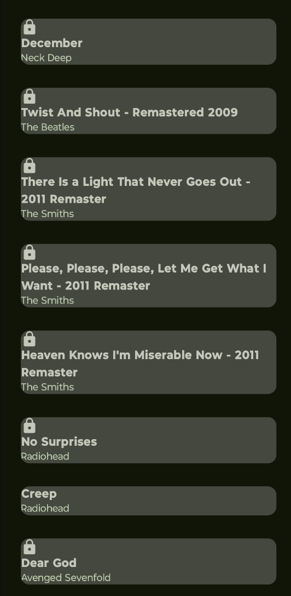

# SingWithMe Karaoke App

## Project Overview

This repository contains the Android application for the SingWithMe Karaoke project. The application allows users to sing along with their favorite songs while displaying the lyrics in real-time. The lyrics change color as the song progresses, providing a dynamic karaoke experience.

## Table of Contents

1. [Application](#application)
2. [Features](#Features)
3. [Documentation](#documentation)
4. [APK](#apk)


## Application

The package ID of the application is: `fr.enssat.singwithme.charbonneauGilles`.
A detailled documentation can be found [here](Documentation.md).

### Features

- **Real-time Lyrics Display**: Lyrics are displayed in real-time as the song progresses.
- **Dynamic Color Change**: Lyrics change color from white to red as the current timestamp progresses.
- **Song Selection**: Users can select songs from a list.
- **Media Controls**: Play, pause, and reset controls for the media player.

### Screenshots





### APK
 The link [here](app/singwithme.apk) point to the `singwithme.apk` file. You can install on your phone the app as it is in the code on this repo. 

## Build System

All necessary files for building the application are included in this repository. 

 **Clone the Repository**:
   ```sh
   git clone https://github.com/your-username/singwithme.git
